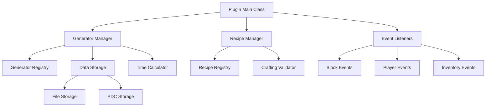

# Design Document: Resource Generator Plugin

## Overview

The Resource Generator Plugin is a Paper 1.21.11 Minecraft plugin that allows players to craft special generator devices using predefined recipes. These generators appear as custom blocks (e.g., iron blocks for Iron Farms) and accumulate resources over time. When players right-click the generator block, the system calculates accumulated resources based on elapsed time and configured generation rates, then displays them in a chest-like interface.

The plugin uses a passive generation system - no background processing occurs. Resources are calculated and added only when players open the generator interface, making it efficient and server-friendly.

## Architecture

The plugin follows a modular architecture with clear separation of concerns:



## Components and Interfaces

### Core Components

#### GeneratorManager
- **Purpose**: Central coordinator for all generator operations
- **Responsibilities**:
  - Create and destroy generators
  - Calculate accumulated resources
  - Manage generator state and storage
  - Handle player interactions

#### RecipeManager  
- **Purpose**: Manages crafting recipes and validation
- **Responsibilities**:
  - Register generator recipes on plugin startup
  - Validate crafting patterns
  - Handle recipe conflicts
  - Load recipes from configuration

#### GeneratorType
- **Purpose**: Defines generator specifications
- **Properties**:
  - Recipe pattern (3x3 grid)
  - Output item type and quantity
  - Generation rate (time per item)
  - Block appearance
  - Storage capacity

#### Generator Instance
- **Purpose**: Represents an active generator in the world
- **Properties**:
  - Location (world, x, y, z)
  - Generator type
  - Owner UUID
  - Last accessed timestamp
  - Current storage contents

### Event Handling

#### CraftingEventListener
- Listens for PrepareItemCraftEvent
- Validates generator recipes
- Handles generator creation

#### BlockEventListener  
- Listens for BlockPlaceEvent and BlockBreakEvent
- Manages generator placement and destruction
- Handles block protection

#### PlayerInteractionListener
- Listens for PlayerInteractEvent
- Opens generator interfaces
- Calculates and adds accumulated resources

## Data Models

### Generator Configuration
```java
public class GeneratorConfig {
    private String name;
    private Material blockType;
    private ItemStack[] recipe; // 3x3 array
    private ItemStack output;
    private int generationTimeSeconds;
    private int storageCapacity;
}
```

### Generator Instance Data
```java
public class GeneratorData {
    private UUID id;
    private Location location;
    private String generatorType;
    private UUID owner;
    private long lastAccessedTime;
    private List<ItemStack> storedItems;
}
```

### Storage Schema
The plugin uses two storage mechanisms:

1. **Persistent Data Container (PDC)** - For block metadata
   - Generator ID
   - Generator type
   - Owner UUID

2. **File Storage** - For detailed generator data
   - JSON format for generator instances
   - Configuration files for generator types
   - Automatic backup and recovery

## Correctness Properties

*A property is a characteristic or behavior that should hold true across all valid executions of a system-essentially, a formal statement about what the system should do. Properties serve as the bridge between human-readable specifications and machine-verifiable correctness guarantees.*

Based on the prework analysis of acceptance criteria, here are the key correctness properties:

### Property 1: Recipe Pattern Recognition
*For any* crafting grid arrangement, if it matches a valid generator recipe pattern (Iron Farm or Villager Breeder), the system should recognize the correct generator type, and if it doesn't match any pattern, the system should reject it.
**Validates: Requirements 1.1, 1.6, 7.3**

### Property 2: Valid Crafting Behavior  
*For any* valid generator recipe (Iron Farm or Villager Breeder), when crafted successfully, the system should consume the crafting materials and create the appropriate generator with correct type and configuration.
**Validates: Requirements 1.4, 7.4**

### Property 3: Invalid Crafting Protection
*For any* invalid crafting attempt, the system should not consume materials and should provide appropriate feedback to the player.
**Validates: Requirements 1.5**

### Property 4: Time-Based Resource Calculation
*For any* generator and any time period, when a player opens the generator interface, the system should calculate accumulated resources using the formula: (elapsed_time / generation_rate) * output_quantity, respecting storage capacity limits.
**Validates: Requirements 2.2, 2.3, 2.4, 3.2, 3.3, 4.2, 4.3, 4.4**

### Property 5: Passive Generation System
*For any* generator, the system should perform no background processing and only calculate/add resources when the generator interface is opened by a player.
**Validates: Requirements 5.1, 5.4, 5.5**

### Property 6: Configuration System Integrity
*For any* generator type configuration, the system should load all settings (generation rates, storage limits, recipes) correctly and apply configuration changes without requiring server restart.
**Validates: Requirements 6.1, 6.2, 6.3, 6.4, 6.5, 7.2**

### Property 7: Generator Interface Consistency
*For any* generator block, when right-clicked by an authorized player, the system should open a custom inventory interface displaying all accumulated resources and allowing standard chest-like item extraction.
**Validates: Requirements 8.1, 8.2, 8.5**

### Property 8: Storage Capacity Management
*For any* generator at maximum capacity, the system should stop resource generation until space becomes available and should never exceed the configured storage limit.
**Validates: Requirements 8.4**

### Property 9: Data Persistence Round-Trip
*For any* generator, saving its state to persistent storage and then restoring it (including across server restarts) should preserve all generator data including location, type, storage contents, and last access time.
**Validates: Requirements 9.1, 9.2, 9.5**

### Property 10: Generator Cleanup Consistency
*For any* generator that is destroyed, the system should remove all associated data, drop stored items, and remove block protections completely.
**Validates: Requirements 9.3, 11.5**

### Property 11: Permission-Based Access Control
*For any* player and any generator operation (creation, usage, interface access), the system should check appropriate permissions and only allow the operation if permissions are satisfied.
**Validates: Requirements 10.1, 10.2, 10.3, 11.3, 11.4**

### Property 12: Block Protection Enforcement
*For any* generator block, unauthorized players should be prevented from breaking the block or accessing its interface, while authorized players should have full access.
**Validates: Requirements 11.1, 11.2**

<function_calls>
<invoke name="prework">
<parameter name="featureName">resource-generator
## Generator Configurations

### Iron Farm
- **Recipe Pattern**:
  ```
  BED BED BED
  COM HOP COM  
  LAV CHE WAT
  ```
  Where: BED = any bed type, COM = composter, HOP = hopper, LAV = lava bucket, CHE = chest, WAT = water bucket
- **Block Type**: Lit Furnace
- **Output**: Iron Ingot (1 per generation cycle)
- **Generation Rate**: 3 seconds per iron ingot
- **Storage Capacity**: 1,728 items (27 slots × 64 items per slot)

### Villager Breeder
- **Recipe Pattern**:
  ```
  CAR CAR CAR
  BED BED BED
  BRE BRE BRE
  ```
  Where: CAR = carrot, BED = any bed type, BRE = bread
- **Block Type**: Lit Furnace  
- **Output**: Villager Spawn Egg (1 per generation cycle)
- **Generation Rate**: 30 seconds per villager spawn egg
- **Storage Capacity**: 1,728 items (27 slots × 64 items per slot)

## Error Handling

The plugin implements comprehensive error handling across all components:

### Configuration Errors
- **Invalid Recipe Patterns**: Log warnings and use default patterns
- **Missing Configuration Files**: Create default configurations automatically
- **Malformed JSON**: Log errors and skip invalid entries
- **Conflicting Recipes**: Prevent plugin startup and log detailed conflict information

### Runtime Errors
- **Data Corruption**: Graceful degradation with detailed logging
- **Storage Failures**: Retry mechanisms with exponential backoff
- **Permission Failures**: Clear user feedback with actionable error messages
- **Invalid Generator States**: Automatic cleanup and player notification

### Player Interaction Errors
- **Insufficient Permissions**: Informative messages explaining required permissions
- **Full Storage**: Visual indicators and prevention of resource loss
- **Invalid Crafting**: Clear feedback about recipe requirements
- **Network Issues**: Graceful handling of disconnections during generator operations

## Testing Strategy

The plugin uses a dual testing approach combining unit tests and property-based tests for comprehensive coverage:

### Unit Testing
- **Specific Examples**: Test concrete scenarios like Iron Farm creation
- **Edge Cases**: Test boundary conditions (full storage, zero time elapsed)
- **Integration Points**: Test component interactions and event handling
- **Error Conditions**: Test all error handling paths and recovery mechanisms

### Property-Based Testing
- **Framework**: Uses JUnit 5 with jqwik for property-based testing
- **Test Configuration**: Minimum 100 iterations per property test
- **Universal Properties**: Test the 12 correctness properties defined above
- **Input Generation**: Smart generators that create valid game states and edge cases

### Test Organization
Each property-based test is tagged with its corresponding design property:
- **Tag Format**: `Feature: resource-generator, Property {number}: {property_text}`
- **Requirements Traceability**: Each test references the requirements it validates
- **Comprehensive Coverage**: Unit tests handle specific examples, property tests verify universal behavior

### Testing Guidelines
- Property tests validate universal correctness across all inputs
- Unit tests catch concrete bugs and verify specific functionality
- Both approaches are complementary and necessary for reliable software
- Tests must validate real functionality without mocking core logic